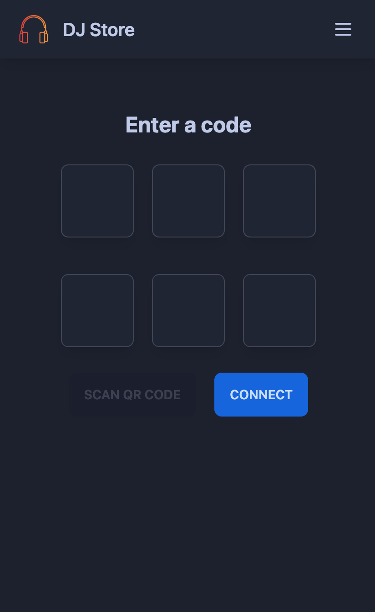
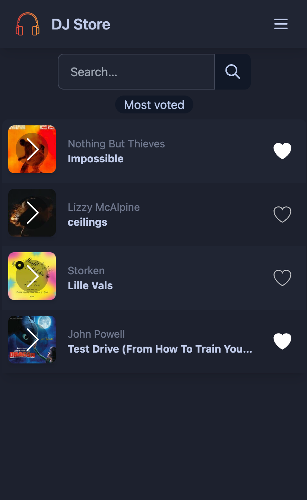

# DJ-store

**DJ-store** is an application that allows DJs to get recommendations from people on the dancefloor. The idea is simple: dancers can scan a QR code and vote for the songs they want to hear. The DJ can then use this feedback to adjust their playlist and keep the dancefloor packed.

<p align="center">
    
    
</p>

## Features

* DJs can create a room and share it with their audience
* Dancers can join a room by scanning a QR code or entering a code
* Dancers can search and vote for songs
* DJs can see the votes in real time

The search feature is powered by the [Deezer API](https://developers.deezer.com/api).

### /!\ Disclaimer /!\

Please note that DJ-store is a proof-of-concept project and is not intended for production use. You must ensure compliance with the [Deezer API Terms of Use](https://developers.deezer.com/termsofuse).

## Getting started

This project is made of two parts:

* A backend server written in Rust
* A frontend client written in Svelte

### Prerequisites

To run DJ-store on your machine, you'll need to have:

* **Rust, Cargo**: [Install Rustup](https://www.rust-lang.org/tools/install)
* **Node.js**: [Install Node](https://nodejs.org/en/download/) (recommeded: [NVM](https://github.com/nvm-sh/nvm#installing-and-updating))
* **Yarn**: [Install Yarn](https://yarnpkg.com/getting-started/install)

### Development

To start the backend server, run:

```bash
cargo run
```

This will start the server on port `3000`. By default, it will also build and serve the frontend. If you make any changes to the frontend code, you'll need to manually rebuild it.

If you want to run the frontend separately, you can do so by running:

```bash
cd ui
yarn dev
```

This will start the dev server on port `5173` with hot reload.

The `ui/.env` file contains an optional variable `VITE_API_URL` that you can use to specify the backend URL. By default, it will be `http://localhost:3000`.

### Release build

To build the backend for production, run:

```bash
cargo build --release
# or with custom feature flags
cargo build --release --no-default-features --features https,embed-ui
```

Feature flags:

* `embed-ui`: Embed the frontend in the binary (enabled by default)
* `https`: Enable HTTPS support

To build the frontend for production, run:

```bash
cd ui
export VITE_API_URL=https://[your-backend-url]
yarn build
```

This will create a `dist` folder containing the static files.  
The `VITE_API_URL` variable is optional. If you don't specify it,
the frontend will use the dynamic host from the window.

#### Docker

A docker image is also available to build:

```bash
docker build -t dj-store:latest .
```

The image is from scratch and only contains the binary, it's extremely small (~5MB).
That's fun, but it means that every dependency is statically linked and you can't debug inside the image.
